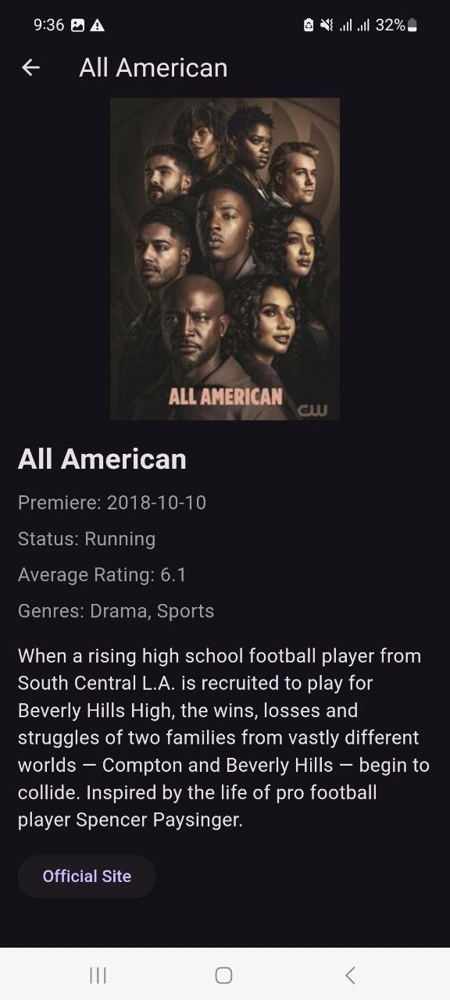

# Movie App

A Flutter application designed to provide a user-friendly interface for exploring and searching for movies using the TVmaze API. This app adheres to Clean Architecture principles to ensure maintainability and scalability.

## Table of Contents

- [Movie App](#movie-app)
  - [Table of Contents](#table-of-contents)
  - [Features](#features)
  - [Screenshots](#screenshots)
  - [Getting Started](#getting-started)
    - [Prerequisites](#prerequisites)
    - [Installation](#installation)
    - [Running the App](#running-the-app)
  - [Project Structure](#project-structure)
    - [Directory Descriptions](#directory-descriptions)
  - [Technologies Used](#technologies-used)
  - [Contributing](#contributing)
  - [License](#license)
  - [Acknowledgments](#acknowledgments)

## Features

- **Splash Screen**: A welcoming transition screen that leads users to the main content.
- **Movie Search**: Users can search for movies using the TVmaze API with real-time results.
- **Responsive UI**: The interface is designed to adapt to various screen sizes and orientations.
- **Detail View**: Users can navigate to a detailed screen for each movie, showcasing additional information like summary, genres, and ratings.
- **Error Handling**: Provides user-friendly messages for search results and API errors.

## Screenshots




## Getting Started

### Prerequisites

- Flutter SDK (v3.0.0 or later)
- Dart SDK
- An IDE such as Visual Studio Code or Android Studio
- An emulator or physical device for testing

### Installation

1. **Clone the repository:**

   ```bash
   git clone https://github.com/Sireat/movie_app.git
   cd movie_app
   ```

2. **Get the dependencies:**

   ```bash
   flutter pub get
   ```

### Running the App

To run the application, execute the following command:

```bash
flutter run
```

Ensure that a device or emulator is connected and running.

## Project Structure

```
lib/
├── core/
│   ├── utils/               # Utility functions and helpers
│   └── widgets/             # Reusable widgets across the application
├── data/
│   ├── datasources/         # Data sources (API, local database, etc.)
│   ├── models/              # Data models that represent the API response
│   └── repositories/        # Repository pattern for data access
├── domain/
│   ├── entities/            # Domain entities that represent core data models
│   ├── repositories/        # Abstract classes for repositories
│   └── usecases/            # Business logic and use cases
├── presentation/
│   ├── provider/            # State management (Provider)
│   ├── screens/             # UI screens of the application
│   └── widgets/             # Custom UI widgets
└── main.dart                # Entry point of the application
```

### Directory Descriptions

- **core/**: Contains utility functions and reusable widgets that can be used throughout the application.
  
- **data/**:
  - **datasources/**: Handles data fetching from external APIs or databases.
  - **models/**: Contains data models that map to the API responses, making it easier to manage data.
  - **repositories/**: Implements the repository pattern to abstract data sources and provide a unified API for the domain layer.

- **domain/**:
  - **entities/**: Represents the core business models that are used throughout the app.
  - **repositories/**: Defines the abstract repositories that the data layer will implement.
  - **usecases/**: Contains the business logic that acts as a bridge between the presentation layer and the data layer.

- **presentation/**:
  - **provider/**: Contains state management logic using the Provider package.
  - **screens/**: All the UI screens of the application.
  - **widgets/**: Custom widgets used across different screens to promote reusability.

## Technologies Used

- Flutter: For building the UI.
- Dart: Programming language used for development.
- Provider: State management solution.
- HTTP: For making API requests.
- TVmaze API: Source of movie data.

## Contributing

Contributions are welcome! If you'd like to contribute to this project, please follow these steps:

1. Fork the repository.
2. Create a new branch (`git checkout -b feature/YourFeature`).
3. Make your changes and commit them (`git commit -m 'Add some feature'`).
4. Push to the branch (`git push origin feature/YourFeature`).
5. Open a Pull Request.

## License

This project is licensed under the MIT License. See the [LICENSE](LICENSE) file for more details.
screenshots
## Acknowledgments

- [TVmaze API](https://www.tvmaze.com/api) for providing the movie data.
- Flutter community for the extensive resources and packages.
- Icons and assets used in the app (ensure proper attribution if required).

```